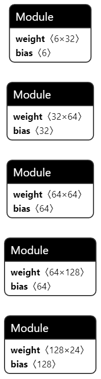

<h1 align="center">
       TMNet
</h1>

<h3 align="center">
    <p>基于Mindspore实现湍流建模</p>
    <p><a href="https://gitee.com/KaiXuana/tmnet-ms">https://gitee.com/KaiXuana/tmnet-ms</a></p>
    <p><a href="https://github.com/NicholasKX/TMNetMS">https://github.com/NicholasKX/TMNetMS</a></p>
</h3>

### 一、概述

湍流是一种三维、非定常、有旋的强非线性多尺度流动，具有强的耗散和色散特性，普遍存在于自然界及工程问题之中，被认为是“经典物理学中最后一个未解决的问题”。
Navier-Stokes（NS）方程是描述流体运动的基本方程。基于求解NS方程的湍流模拟方法，根据计算精度的层次可以分为三种，分别是雷诺平均(RANS, Reynolds Averaged Navier-Stokes Equations)方法、大涡模拟(LES, Large Eddy Simulation)方法和直接数值模拟(DNS, Direct Numerical Simulation)方法。
其中DNS与LES方法对于网格的数量与质量要求较高，计算量很大，目前仍难以广泛应用。RANS方法是目前能够应用于解决工程问题的主要方法，其基本思想是将流场变量分解为平均量和脉动量，并对NS方程进行时间平均，仅对平均量进行求解，所有的脉动量平均之后均为零。平均之后的方程中出现了额外的雷诺应力项，需要建立湍流模型方程进行封闭求解。


### 二、任务介绍
#### 目标
近年来，在人工智能技术与湍流大数据推动下，逐渐形成了湍流研究的数据驱动新范式。深度学习等数据驱动算法可以从数据中捕捉湍流的复杂模式，为复杂流动建模提供了一种具有前途的解决方案。

本赛题希望通过深度学习方法，基于DNS/LES等方法获得的高可信度流场数据，构建一个以流场基本变量及其**组合特征为输入**，**雷诺应力为输出**的数据驱动模型，实现对于雷诺应力的准确模化，从而在计算量可接受的前提下提高RANS方程对于复杂流动的模拟精度。
#### 数据集
官方提供了周期山、方管、后台阶、压缩拐角等外形在不同工况下的DNS/LES模拟数据，其中80%用于训练、20%用于验证（模型测试用，非公开）。数据中的输入特征主要有密度、压力、速度、压力梯度、速度梯度等，这些都是流动的基本特征，通过特征工程构建、选择更多的特征来提高模型的竞争力。模型的输出特征为**雷诺应力的6个分量**。

### 三、技术难点

湍流建模所面临的挑战主要包含以下几个方面：

首先，训练数据在数值上存在**量级差异**。然而，在经典的均方差(MSE)损失函数下，简单的增加神经元的数目不仅效果不明显还容易造成过拟合问题。所以，需要具体**设计损失函数**和**自适应学习策略**。

其次是**模型的泛化能力**。流场变量之间的强非线性，这需要根据流动的物理规律，在把握流场特性的基础上精心设计巧妙的建模策略。此外，构建和选择的模型输入特征及其形式对泛化能力的影响也十分重要。

最后是模型对输入微小变化的高敏感性则会造成残值的振荡、收敛速度变慢甚至不收敛。

### 四、技术路径

建模流程包括数据预处理、特征构建和选择、损失函数设计以及网络训练。

**数据预处理：** 去除异常值，补齐缺失值，数据采用Zscore归一化。

$\hat{X}=\frac{X-X.mean}{X.std}$

**特征构建及选择：**

在特征构造上，选取有物理含义的特征，包括
$U, V, W$: 流体在x, y, z方向的速度成分。
$U_x, U_y, U_z$: U速度关于x, y, z的偏导数。
$V_x, V_y, V_z$: V速度关于x, y, z的偏导数。
$W_x, W_y, W_z$: W速度关于x, y, z的偏导数。

在这些特征的基础上我们做了特征工程，添加了一些特征，包括
$U_V, U_W, V_W$: 流体在x, y, z方向的速度交互。
$U^2, V^2, W^2$: 流体在x, y, z方向的速度平方。
$U_xV_y, V_yW_z, U_xW_z$: 流体在x, y, z方向的速度交互关于x, y, z的偏导数。
$Omega_x, Omega_y, Omega_z$: 涡量。
$U_{grad}, V_{grad}, W_{grad}$: 流体在x, y, z方向的速度梯度。梯度（慎用）只有输入数据是顺序的时候才能使用

以上特征作为模型输入。特征使用**Fp32精度**计算。


**模型设计：**
选择全连接神经网络来预测雷诺应力的6个分量，网络共有四个隐藏层每层的神经单元数分别为128、64、64、32层与层之间的激活函数是ReLU。



模型的损失函数如下：

损失函数由三部分组成

$\ { Loss }=\alpha \times  M A E+\beta \times (1-R 2)+  \gamma \times( { PhysicsLoss })$

$MAE$ 计算预测值和Label的平均绝对误差

$1-R2$ 计算预测值和Label的R2 Score

$PhysicsLoss$ 计算预测值和Label的物理约束损失(输出的六个分量的相关矩阵应为半正定)。

采用10折交叉验证的训练方法，训练的batch size为**1000**，初始学习率为**0.001**，随着训练持续和误差减小，采用余弦退火学习率调度器动态地减少学习率，训练epoch为**$50$**时，训练集和验证集误差就趋于稳定，误差稳定在**1e-3**的数量级上，R2稳定在**0.97**以上。

### 五、评价指标
两种评价指标：
（1）模型预测值与真实值之间的平均绝对误差$MAE$，误差越小越好。
（2）模型预测值与真实值之间的$R2 Score$ ($R2\in{(-\infty,1]}$)，该分数越接近于1越好。

 针对不同的特征组合，我们进行了消融实验：


| Experiment | Velocity | Polynomial | Derivative | Vorticity | Gradient | MAE      | R2     |
| :--------: | :------- | ---------- | ---------- | --------- | -------- | -------- | ------ |
|     1      | False    | False      | False      | False     | False    | 0.001597 | 0.9568 |
|     2      | True     | False      | False      | False     | False    | 0.001313 | 0.9708 |
|     3      | True     | True       | False      | False     | False    | 0.001329 | 0.9709 |
|     4      | True     | True       | True       | False     | False    | 0.001388 | 0.9687 |
|     5      | True     | True       | True       | False     | True     | 0.001252 | 0.9744 |
|     6      | True     | True       | True       | True      | False    | 0.001319 | 0.9712 |

90%数据上训练的最终实验结果如下：

|      Experiment      | Velocity | Polynomial | Derivative | Vorticity | Gradient | MAE      | R2     |
| :------------------: | -------- | ---------- | ---------- | --------- | -------- | -------- | ------ |
|     90%数据训练      | True     | True       | True       | True      | False    | 0.000244 | 0.9988 |
|                      | True     | True       | True       | False     | False    | 0.000258 | 0.9986 |
|                      | True     | True       | True       | False     | True     | 0.000413 | 0.9979 |
| 90%数据训练-顺序划分 | True     | True       | True       | True      | False    | 0.001441 | 0.4012 |

### 六、代码结构
```shell
model_zoo
├── TMNetMS                                     # 官方支持模型
│   └── TMNetMS                                 # 模型名
│       ├── README.md                           # 模型说明文档
│       ├── requirements.txt                    # 依赖说明文件
│       ├── eval.py                             # 精度验证脚本
│       ├── config                              # 配置文件目录
│       │   ├── turbulencenet_config.yaml       # 具体配置文件
│       ├── logs                                # 训练好的模型目录
│       ├── data                                # 数据文件
│       │   ├── zscore.pkl                      # 存储均值和标准差的文件
│       │   └── readme.md                       # 说明文档
│       │   └── metrics_result.json             # 精度验证结果保存文件
│       ├── scripts                             # 脚本文件
│       │   ├── run_eval.sh                     # 验证脚本
│       │   └── run_train.sh                    # 单机训练脚本
│       ├── src                                 # 模型定义源码目录
│       │   ├── turbulencenet.py                # 模型结构定义
│       │   ├── loss.py                         # 模型损失函数
│       │   ├── trainer.py                      # 模型训练器定义
│       │   └── dataset.py                      # 数据集处理定义
│       ├── train.py                            # 训练脚本
└───────└── weight_transfer.py                  # 权重迁移脚本
```
#### 训练
```shell
# 单机训练
bash scripts/run_train.sh
```
或者
```shell
# 单机训练
python train.py --config "config/turbulencenet_config.yaml"
```

####  推理验证
推理数据请放在data目录下，数据格式为csv格式，并且确保数据包括这些列：    
['U', 'V', 'W', 'U_x', 'U_y', 'U_z', 'V_x', 'V_y', 'V_z', 'W_x', 'W_y', 'W_Z','UU', 'UV', 'UW', 'VV', 'VW', 'WW']
推理结果会保存在data目录下的metrics_result.json文件中。

```shell
# 验证
bash scripts/run_eval.sh
```
或者
```shell
# 验证
python eval.py --data_root './data' --csv_file 'duct_Re2400.csv' --fold_num 10
```
